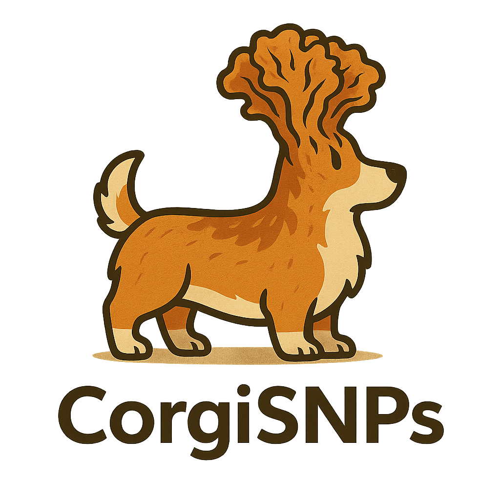

# CorgiSNPs: Core Genome Investigation SNPs
## Key Features
CorgiSNPs is a fungal core-genome SNP pipeline that can:

🧬 Detect SNPs from fungal whole-genome sequencing data \
🧬 Handle polyploid and dikaryotic genomes with improved robustness \
🧬 Generate phylogenies and pairwise distance matrices \
🧬 Provide sample- and cluster-level summaries suitable for downstream visualization \
🧬 Export results in standard formats (VCF, FASTA, Newick, CSV)

CorgiSNPs is designed for public health fungal genomics (currently only tested with *Candidozyma auris* (*Candida auris*)). It builds on the foundation of MycoSNP but improves workflow automation, handling of higher ploidy organisms, and phylogenetic interpretation.

## Pipeline Overview
- **Prepare** – QC and assembly/consensus generation \
- **Classify** – Taxonomic ID and subtyping \
- **Variants** – Variant calling across samples \
- **AMR** – Detection of antifungal resistance markers \
- **Phylo** – Core SNP phylogenetics and distance metrics \
- **Report** – Interactive and static summaries

## More Information

See the documentation
 for usage and setup details. (coming soon!)

## Acknowledgements

CorgiSNPs would not be possible without the contributions of:
- Washington State Department of Health – Public Health Laboratories \
- Collaborators at CDC Mycotics Branch
- nf-core and the broader Nextflow community

CorgiSNPs was originally written by Jared Johnson for fungal pathogen surveillance at the Washington State Department of Health.
